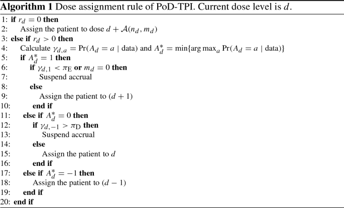

## PoD-TPI: Probability-of-Decision Toxicity Probability Interval Design to Accelerate Phase I Trials

### Introduction

We have proposed the PoD-TPI design to accelerate phase I trials and have developed a statistical methodology to calculate the posterior distribution of a dose assignment decision in the presence of pending toxicity outcomes. The posterior distribution directly reflects the confidence of all possible decisions, and the optimal decision is computed under a decision-theoretic framework. The **`PoD-TPI`** design is built upon the **`mTPI-2`** design. Nevertheless, the proposed strategy can be applied to the **`i3+3`** design.

This repository is based on the article: Zhou, T., Guo, W. & Ji, Y. PoD-TPI: Probability-of-Decision Toxicity Probability Interval Design to Accelerate Phase I Trials. Stat Biosci 12, 124–145 (2020).

### Example Dataset 
We will use a dataset similar to the one in the Fig.1(a) of the PoD-TPI paper. The input dataset **`df`** should include at least three columns: **`dose`**, **`event_time`** and **`event`**. Suppose that you are assigning a dose level to the nth patient of the trial, the 'dose' column should contain the dose level history of all past (n-1) patients and the 'event_time' column should contain the time to event(DLT here) observed for all past (n-1) patients, and the 'event' column should contain whether event is observed on each patient.

There are several restrictions here. First, The input dataset should be arranged according to the order of patient recruitment. Patients recruited later need to be placed later in the dataset. Second, the **`event_time`** variable must be less than or equal to the DLT assessment window. If DLT is not observed on a patient within the assessment window, the event_time should be equal to assessment window. Third, for patients with pending outcomes, their **`event`** variable should be NA and their **`event_time`** variables are the pending follow-up times.

```
df <- data.frame(dose = c(1, 2, 2, 2, 2, 2),
                 event_time = c(28, 28, 9, 26, 15, 8),
                 event = c(0, 0, 1, 1, NA, NA))
```


### Other Parameters
**current_dose:** current dose assignment for the incoming patient.

**W:** DLT assessment window.

**MaxDose:** max dose level of the trial.

**p_T:** target DLT rate.

**epsilon:** 2 dimensional vector, the bounds of the equivalence interval.

**niter:** number of iterations for MCMC sampling, greater the better, > 1000 recommended.

**type_dose_decision:** Can be "mTPI" or "i3+3", the base complete data dose decision


**type_suspension:** Three types of suspension rules.

= 0: Never suspends

= 1: Suspend if r_d > (n_d + m_d + r_d) / 2 

= 2: Suspend based on probability thresholds

= 3: Suspend if Pr(decision) < 1, i.e., "look-ahead" design

Suppose n_d is the number of DLT patients observed and m_d is the number of non-DLT patients observed and r_d is the number of pending patients

(1) if no observed outcome at current dose (n_d + m_d = 0), always stay.
    when suspension type is 2, if r_d >= 3 and n_d + m_d = 0, also suspend
    
(2) if m_d = 0, no non-DLTs, for suspension rules 0 or 1, if decision is E, change to S.
    for suspension rule 2, if decision is E, suspend

**type_safety:** Three types of safety rules.

= 0: No safety rule

= 1: Only early termination

= 2: Both safety rules


**q1:** pi_E for Trial Suspension, must be within [0.33, 1], > 0.8 recommended. A larger pi_E represents more conservative dose escalations.

**q2:** pi_D for Trial Suspension, must be within [0, 0.5], <= 0.25 recommended. A smaller pi_D represents more conservative stays.

#### **p_prior Setting**
The `p_prior` parameter defines the prior distribution for the probability of experiencing a DLT at each dose level. There are two main options for `p_prior`:

- **`p_prior = "uniform"`**: This setting assumes a uniform prior distribution, meaning that initially, all dose levels are considered equally likely to be associated with a DLT. This is a non-informative prior, implying that no strong assumptions are made about the DLT probabilities before observing the data. This approach is often used when there is limited prior knowledge about the toxicity of the doses.

- **`p_prior = "semiparametric"`**: This setting uses a semiparametric prior distribution, which is more flexible and can incorporate prior beliefs or information about the DLT probabilities at different dose levels. In this case, the prior distribution is partially informed by a set of hyperparameters, such as `theta`, which reflects prior knowledge about the true maximum tolerated dose (MTD), and `c`, which controls the strength of this prior belief.

#### **t_model Setting**
The `t_model` parameter specifies the model used for the time-to-toxicity (the time until a patient experiences a DLT). Different models can be chosen to reflect various assumptions about how the risk of toxicity changes over time:

- **`t_model = "uniform"`**: This setting assumes that the risk of experiencing a DLT is uniformly distributed over the assessment window `W`. In other words, the probability of experiencing a DLT is constant over time.

- **`t_model = "pwuniform"`**: This setting assumes a piecewise-uniform distribution for time-to-toxicity. The assessment window `W` is divided into `K` intervals defined by the vector `h`, and within each interval, the probability of experiencing a DLT is constant but may differ between intervals. This allows the model to capture changes in risk over time more flexibly than the uniform model.

- **`t_model = "dhazard"`**: This setting uses a discrete hazard model for time-to-toxicity. The hazard (or risk) of experiencing a DLT can vary at discrete time points within the assessment window. This model is useful when the risk of DLT might change abruptly at specific times, rather than continuously.

- **`t_model = "pwhazard"`**: This setting assumes a piecewise constant hazard model, where the risk of DLT is constant within each interval defined by `h`, but can change between intervals. This is similar to `pwuniform`, but focuses on the hazard rate rather than the probability of toxicity.


### Safety Rules
**Safety rule 1 (early termination)**: At the lowest dose level and any moment in the trial, when there are >= 3 patients with observed outcomes(n_1 + m_1 >= 3), if the probability of the patient having a DLT probability greater than the target probability p_T is greater than 0.95, even counting pending patients as non-DLT, the trial should be terminated: $$\Pr(p_1 > p_T \mid n_1, m_1+r_1) > 0.95$$ 

**Otherwise** if not counting pending patients as non-DLT, the trial should be suspended: $$\Pr(p_1 > p_T \mid n_1, m_1) > 0.95$$

**Safety rule 2 (dose exclusion)**: At any dose level d and any moment in the trial, when there are >= 3 patients with observed outcomes(n_d + m_d >= 3), if the probability of the patient having a DLT probability greater than the target probability p_T is greater than 0.95, Suspend dose d and higher doses from the trial: $$\Pr(p_d > p_T \mid n_d, m_d) > 0.95$$


### Run POD-TPI
```
POD_TPI_df(df, current_dose = 2, W = 28, MaxDose = 4,
           p_T = 0.3, epsilon = c(0.05, 0.05), 
           niter = 1000,
           type_dose_decision = "mTPI",
           type_p_prior = "uniform",
           type_t_model = "pwuniform",
           type_suspension = 2,
           type_safety = 2,
           q1 = 1, q2 = 0.15)

## $Decision
## [1] "Dose decision: De-escalation. Dose assignment for this patient: 1. Current dose: 2, DLT Patients: 2, Non-DLT Patients: 2, Pending Patients: 2."
## 
## $`Probability of De-escalation`
## [1] 0.6899534
## 
## $`Probability of Stay`
## [1] 0.3100466
## 
## $`Probability of Escalation`
## [1] 0
```

### Output
Dose decision will be decided from four possible choices(Suspend, De-escalation, Stay, Escalation). The recommended dose assignment for the current patient will also be given.


### Algortihm of POD-TPI



### Package Requirement
Run the following code in R:

```
install_missing_packages <- function(packages) {
  for (pkg in packages) {
    if (!requireNamespace(pkg, quietly = TRUE)) {
      install.packages(pkg)
    }
  }
}

packages_to_check <- c("shiny", "dfcrm", "BOIN", "truncdist", 
                        "MCMCpack", "poisbinom", "zoo")

install_missing_packages(packages_to_check)
```

### POD-TPI R Shiny App

```
library(shiny)
runGitHub("POD-TPI", "Ziyu-Liu-WCM")
```